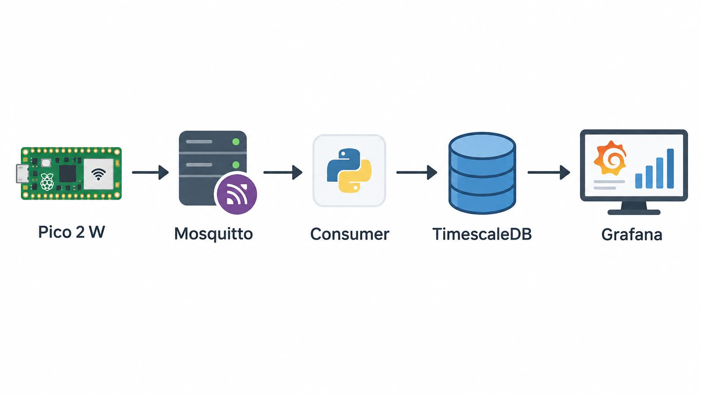
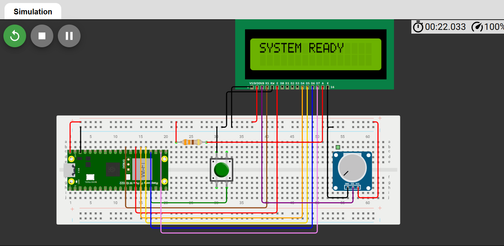
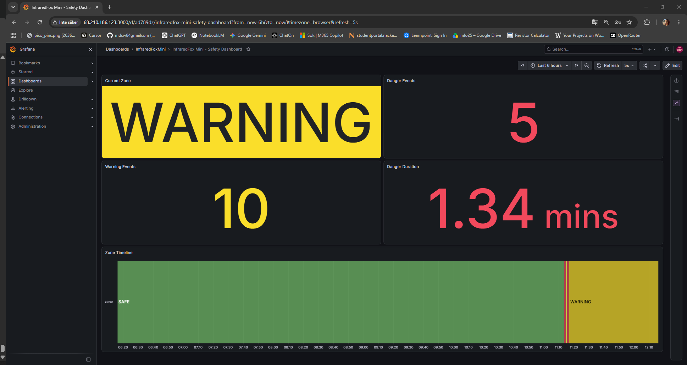

# InfraredFoxMini


InfraredFoxMini is an edge computing prototype for detecting and monitoring objects entering railway risk zones.

The system uses a Raspberry Pi Pico 2 W with infrared break-beam sensors to detect movement between SAFE, WARNING and DANGER zones. The Pico publishes zone changes through MQTT to a containerized backend, where events are stored in TimescaleDB and visualized in Grafana.

## How to run

azure link: 
http://68.210.186.123:3000/
The Azure resource group and VM were removed after the demo to avoid additional costs, so the link is no longer active.


`docker compose up -d` 

shut down the docker 

`docker compose down`

## Architecture




Pico 2 W
→ MQTT / Mosquitto
→ Python Consumer
→ TimescaleDB
→ Grafana

## Hardware

- Raspberry Pi Pico 2 W
- 2 infrared sensors
- Green, yellow and red LEDs
- Buzzer
- LCD 16x2 HD44780
- Push button
- Breadboard
- Potentiometer
- 330 Ω resistor

The system is designed to use IR break-beam sensors. During the final demo, push buttons were used as a sensor simulation/fallback, while the IR sensors had been tested separately.

## Zone Logic

- SAFE: normal state
- WARNING: object approaching the danger area
- DANGER: object detected inside the danger area

The buzzer and LEDs provide local warnings based on the current zone.

## LCD Display

### Wokwi simulation

The hardware setup has been simulated in Wokwi



link: https://wokwi.com/projects/475231800493635585

The LCD was successfully tested in Wokwi but was not used in the physical demo because of an unreliable connection in the display module.


Default state:

`SYSTEM READY`

When a train detection event is active:

`ATTENTION!`
`TRAIN ARRIVING`

The LCD functionality is implemented in the code and tested in Wokwi. In a real system it could be connected to a vibration sensor proper isolated and installed near by the railway.

## Grafana



Grafana is used as the frontend of the system to visualize live data sent from the Pico.

The dashboard is automatically configured through provisioning, so the same setup can be recreated consistently on different devices and after deployment.

In the deployed version, Grafana provides the user interface for monitoring the live data stored in TimescaleDB.

## IoT Pipeline

The Pico connects to Wi-Fi and publishes MQTT messages to:

`infraredfox/safety`

Example payload:

```json
{
  "zone": "WARNING",
  "zone_duration": 2.4,
  "danger_duration": 0
} 
```

Consumer receive the message and store the data in TimescaleDB.
This steps need for futher anlaysis like:
 - when there are more danger event? 
 - in which day?
 - in which station  

## Docker compose 

Has been used for:
- Mosquitto
- Consumer
- TimescaleDB
- Grafana
And for a easy deployment.

## Azure Deployment

The complete pipeline was deployed and tested on a Linux VM in Azure using Docker Compose.

The deployed services were:

- Mosquitto
- Consumer
- TimescaleDB
- Grafana

The Pico sent MQTT data directly to the Azure VM, and Grafana displayed the incoming data live.

The Azure VM and resource group were removed after the demo to avoid additional costs.


## Authors 

Alessandro
Mona
Marian
