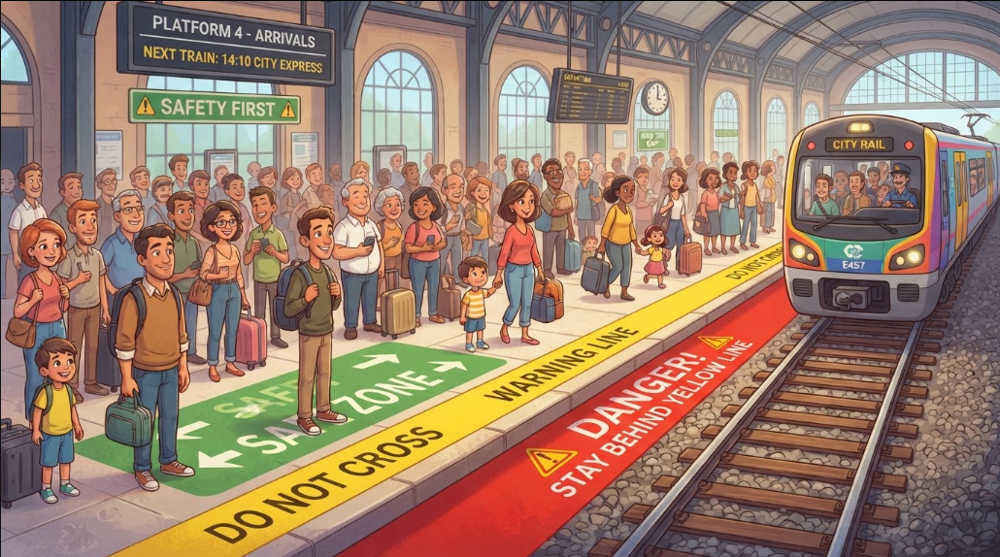

# InfraredFoxMini



InfraredFoxMini is an edge computing prototype for detecting and monitoring objects entering railway risk zones.

The system uses a Raspberry Pi Pico 2 W with infrared sensors to detect movement between SAFE, WARNING and DANGER zones. The Pico publishes zone changes through MQTT to a containerized backend, where events are stored in TimescaleDB and visualized in Grafana.

## How to run

The Raspberry Pi Pico must be connected to the same network as the MQTT broker during local testing.

`docker compose up -d` 

shuth down the docker 

`docker compose down`

## Architecture

Pico 2 W
→ MQTT / Mosquitto
→ Python Consumer
→ TimescaleDB
→ Grafana

## Hardware

- Raspberry Pi Pico 2 W
- 2 infrared sensors
- Green, yellow and red LEDs
- Buzzer
- LCD 16x2 HD44780
- Push button
- Breadboard
- Potentiometer
- 330 Ω resistor

## Zone Logic

- SAFE: normal state
- WARNING: object approaching the danger area
- DANGER: object detected inside the danger area

The buzzer and LEDs provide local warnings based on the current zone.

## LCD Display

The LCD provides local edge monitoring.

Default state:

`SYSTEM READY`

When a train detection event is active:

`ATTENTION!`
`TRAIN ARRIVING`

## IoT Pipeline

The Pico connects to Wi-Fi and publishes MQTT messages to:

`infraredfox/safety`

Example payload:

```json
{
  "zone": "WARNING",
  "zone_duration": 2.4,
  "danger_duration": 0
} 
```

Consumer recive the message and store the data in TimescaleDB.
This steps need for fether anlaisis like:
 - when there are more danger event? 
 - in wich day?
 - in wich station  

## Wokwi simulation

The hardwere setup has been simulated in Wokwi

## Docker compose 

Has been used for:
- Mosquitto
- Consumer
- TimescaleDB
- Grafana
And for a easy deployment.

